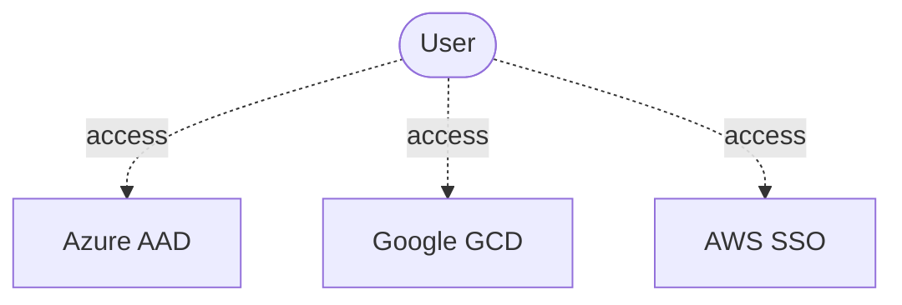

## Why Do We Need IAM Systems?

Each user needs an identity to access a cloud providers.



Your enterprise already has an Enterprise IAM System (like an AD or LDAP). You can use these identities and federate them into the cloud. This helps in hooking into the processes using the existing identities as shown below.

```mermaid
graph TB
	iam[Enterprise IAM System]
	az[Azure AAD]
	gc[Google GCD]
	aws[AWS SSO]
	user([User])

user -- 1. login --> iam
iam -- ? --> az
iam -- ? --> gc
iam -- ? --> aws
user -. 2. access .-> az
user -. 2. access .-> gc
user -. 2. access .-> aws
```

Most organizations rely on an Active Directory (AD) or LDAP on-premise system as a central user directory. Enterprise IAM Systems allows users to access this central directory and assists in the following: 

- Integrating HR workflows and master data for smooth user onboarding and off-boarding.

- Approving workflows like providing approvals for various processes or roles.

All major cloud platforms (AWS, Azure & Google Cloud) offer integrations and solutions for identity federation, identity sync, or managing cloud-native identities. You can read more about each individual implementation below.

## Implementation of IAM System

The following shows an example of high-level architecture. You can access the cloud platforms in two different ways as shown below. One way is to access it directly and the other way is to do it via Enterprise IAM System.

```mermaid
graph TB
	iam[Enterprise IAM System]
	identitySource[(Golden Identity Source)]
	identityConnector[Connector/Sync]
	az[Azure AAD]
	gc[Google GCD]
	aws[AWS SSO]
	user([User])

iam --> identitySource
user -- 1. login --> iam
identitySource --> identityConnector
identityConnector --> az
identityConnector --> gc
identityConnector --> aws
user -. 2. access .-> az
user -. 2. access .-> gc
user -. 2. access .-> aws
```

### Azure Active Directory (AAD)

The tool [Azure AD Connect Sync](https://docs.microsoft.com/en-us/azure/active-directory/hybrid/how-to-connect-sync-whatis) is useful to sync the central enterprise AD and Azure. This allows leveraging a  [hybrid identity](https://docs.microsoft.com/en-us/azure/active-directory/hybrid/) architecture to federate AAD authentication to an on-premise ADFS service.

This assists users, groups and memberships to be synced into an AAD Tenant owned by the organization.

### Google Cloud Identity

Use the tool [Google Cloud Directory Sync](https://support.google.com/a/answer/106368?hl=en) (GCDS) to sync the central enterprise AD or LDAP to Google Cloud Identity. This federated authentication to an on-premise authentication service such as ADFS or any other Identity Provider supporting SAML/OIDC-based authentication is possible.

### AWS SSO

[AWS SSO](https://aws.amazon.com/single-sign-on/) supports the SCIM protocol for identity provisioning and deprovisioning. While SCIM is a well-established protocol, many deployed on-premise IAM systems still lack support for this protocol. Typical IAM architectures deploying AWS SSO, therefore, use a "cloud-enabled" Identity Provider such as Azure Active Directory or Google Cloud Identity that supports SCIM in a "two-tiered" IAM architecture that synchronizes identities from On-Premise to AAD and then from AAD to AWS SSO.

## Who Needs to Be Provisioned on Which Cloud IDP? How to Manage That?→ *Sync Groups*

A fundamental pre-requisite for these federated identity architectures is to determine the set of identities to synchronize to cloud directories. The best practice is to avoid syncing the whole on-premise directory, as this needlessly distributes personally identifiable information (PII) and violates "need to know" principles.

Only a subset of identities managed in an on-premise IAM system is relevant to a cloud foundation. Typically, the relevant set includes IT staff working on cloud-related projects and excludes general office staff. This brings us to the topic of  "sync group", which is a group of users who have been given access to a tenant via your Cloud Foundation Platform. 


