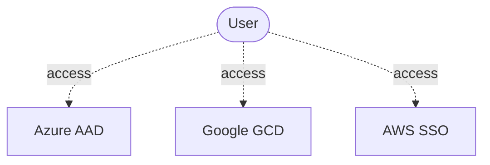
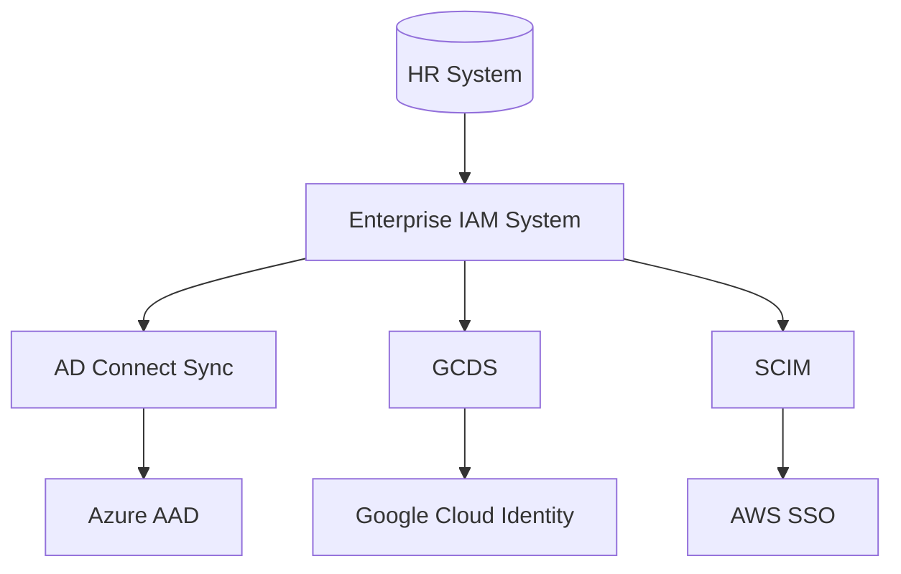

## What Is Identity and Access Management (IAM) System?

Identity and access management (IAM) stands for the **central management** of users and access rights across **systems**, **applications** and in the **cloud.** It is a means of managing **user accounts**
and **privileges** for systems and programs in a **compliant** manner. IAM allows you to **open** the **corporate network** up to external partners, clients and suppliers **without risking** **security breaches.**

## Why We Need Federated Identity and Authentication Management?

User Identity refers to an electronic identity utilized for interaction with software. Each user needs user identity to access a cloud provider as shown below:

The system **ascertains** the user’s **identity**, usually through a combination of **user name** and **password** or by retrieving **biometric data** (*authentication*). The established *identity* is associated with certain **access rights** (*authorization*). 

IAM systems also support **federated identities**, meaning that identity information can be exchanged and managed **across technical boundaries** (e.g., between computers and the cloud). Your enterprise already has an Enterprise IAM System (like an AD or LDAP). You can use these identities and federate them into the cloud. This helps in hooking into the processes using the existing identities. 

Today, businesses and corporations are becoming more and more a mixture of on-premises and cloud applications. Users require access to those applications both on-premise and in the cloud. Managing users both on-premise and in the cloud poses challenging scenarios.

The identity solutions span on-premises and cloud-based capabilities. These solutions create a common user identity for authentication and authorization to all resources, regardless of location. This is referred to as **hybrid identity**.

All major cloud platforms (AWS, Azure & Google Cloud) offer integrations and solutions for identity federation, identity sync, or managing cloud-native identities. You can read more about each individual implementation below

## Best Practices for Implementing Federated Identity and Authentication System

The following shows an example of high-level architecture. You can access the cloud platforms via Enterprise IAM System as shown below. Most organizations rely on an Active Directory (AD) or LDAP on-premise system as a central user directory. Enterprise IAM Systems allows users to access this central directory and assists in the following: 

- Integrating HR workflows and master data for smooth user onboarding and off-boarding.

- Approving workflows like providing approvals for various processes or roles.

### Azure Active Directory (AAD)

The tool [Azure AD Connect Sync](https://docs.microsoft.com/en-us/azure/active-directory/hybrid/how-to-connect-sync-whatis) is useful to sync the central enterprise AD and Azure. This allows leveraging a [hybrid identity](https://docs.microsoft.com/en-us/azure/active-directory/hybrid/) architecture to federate AAD authentication to an on-premise ADFS service.

This assists users, groups and memberships to be synced into an AAD Tenant owned by the organization.

### Google Cloud Identity

Use the tool [Google Cloud Directory Sync](https://support.google.com/a/answer/106368?hl=en) (GCDS) to sync the central enterprise AD or LDAP to Google Cloud Identity. This federated authentication to an on-premise authentication service such as ADFS or any other Identity Provider supporting SAML/OIDC-based authentication is possible.

### AWS SSO

[AWS SSO](https://aws.amazon.com/single-sign-on/) supports the SCIM protocol for identity provisioning and deprovisioning. While SCIM is a well-established protocol, many deployed on-premise IAM systems still lack support for this protocol. Typical IAM architectures deploying AWS SSO, therefore, use a "cloud-enabled" Identity Provider such as Azure Active Directory or Google Cloud Identity that supports SCIM in a "two-tiered" IAM architecture that synchronizes identities from On-Premise to AAD and then from AAD to AWS SSO.

## Seven Laws of Identity

Seven so-called "laws of identity" sit beneath federated identity systems.

**1. User control and consent:** Users give permission to share data, and they have at least some say in how shares happen.

**2. Minimal disclosure:** The smallest amount of identifying information is shared, and it's stored securely and deleted quickly.

**3. Justification:** Only those who can prove they need access can get it.

**4. Directed identity:** Protection of identity is paramount, and users should be assigned private identifiers for that purpose. Companies can't work together to build a more permanent view of someone working across platforms.

**5. Competition:** Many identity providers should be supported, as competition breeds better performance.

**6. Human integration:** A real person has a place in the process, reducing the risk of computer-to-computer hacks.

**7. Consistency:** The users have a simple, consistent experience among platforms.

## What Does Sync Groups *refer to?*

A fundamental pre-requisite for these federated identity architectures is to determine the set of identities to synchronize to cloud directories. The best practice is to avoid syncing the whole on-premise directory, as this needlessly distributes personally identifiable information (PII) and violates "need to know" principles.

Only a subset of identities managed in an on-premise IAM system is relevant to a cloud foundation. Typically, the relevant set includes IT staff working on cloud-related projects and excludes general office staff. This brings us to the topic of  "sync group", which is a group of users who have been given access to a tenant via your Cloud Foundation Platform. 

