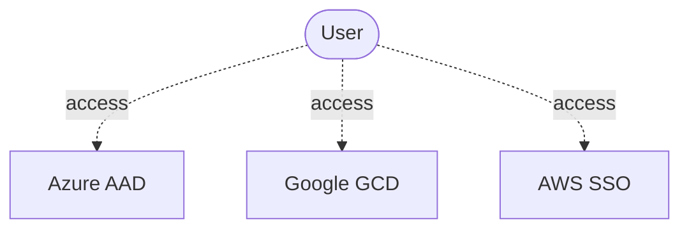

## What Is Identity Lifecycle Management?

Each user needs an identity to access a cloud providers as shown below:



Identity Lifecycle Management refers to the process of managing these user identities and evolving access privileges of employees throughout their work tenure. An identity lifecycle management solution automates and simplifies the processes associated with onboarding and offboarding users, assigning and managing access rights, and monitoring and tracking access activity. Identity Lifecycle Management aims to automate and manage the entire digital identity lifecycle process. 

***So, what is digital ide******tity******?*** It is information on an entity used by one or more operating systems or applications. These entities may represent people, organizations, technical users or IT devices. The identity is usually described by the attributes that are associated with it, such as the name, identifiers, as well as properties such as roles used for access management. 

## Why We Need It?

Many corporate IT and security organizations rely on inefficient manual processes to provision new users and manage their privileges. It can take days (or even weeks in some businesses) to onboard new hires and give them secure access to the applications and IT systems..

Many businesses may have automated processes, for deprovisioning privileges or deactivating user accounts as workers take on new roles or exit the company, but they may not have IT systems integrated with central Identity and Access Management (IAM) systems. As a result, stale accounts often remain in place long after employees leave the business or change positions, which is a GDPR violation.

Identity lifecycle management solutions overcome these challenges by automating manually intensive and error-prone user provisioning and identity governance processes. They help improve employee productivity by allowing new hires access to their applications and IT services from the very first day. They help IT and security organizations free up staff to focus on more important tasks to support the business.

## Organizational Perspective

When planning identity lifecycle management for employees many organizations model the "join, move, and leave" process, which is explained below:

- Join - when an individual needs access, an identity is needed by those applications, so a new digital identity may need to be created if one is not already available

- Move - when an individual moves between boundaries, that require additional access authorizations to be added or removed to their digital identity

- Leave- when an individual leaves the scope of needing access, access may need to be removed, and subsequently the identity may no longer be required by applications

## Implementation

The following shows an example of high-level architecture for multi-cloud identity life cycle management. You can access the cloud platforms in two different ways as shown below. One way is to access it directly and the other way is to do it via Enterprise IAM System. Most organizations rely on an Active Directory (AD) or LDAP on-premise system as a central user directory. Enterprise IAM Systems allows users to access this central directory and assists in the following: 

- Integrating HR workflows and master data for smooth user onboarding and off-boarding.

- Approving workflows like providing approvals for various processes or roles

```mermaid
graph TB
	iam[Enterprise IAM System]
	identitySource[(Golden Identity Source)]
	identityConnector[Connector/Sync]
	az[Azure AAD]
	gc[Google GCD]
	aws[AWS SSO]
	user([User])

iam --> identitySource
user -- 1. login --> iam
identitySource --> identityConnector
identityConnector --> az
identityConnector --> gc
identityConnector --> aws
user -. 2. access .-> az
user -. 2. access .-> gc
user -. 2. access .-> aws
```

### Azure 

Azure AD currently provides these features:

- Users representing employees can be automatically created and updated in Azure AD and Active Directory using [HR-driven provisioning](https://docs.microsoft.com/en-us/azure/active-directory/app-provisioning/what-is-hr-driven-provisioning)

- Users already present in Active Directory can be automatically created and maintained in Azure AD using [inter-directory provisioning](https://docs.microsoft.com/en-us/azure/active-directory/hybrid/what-is-inter-directory-provisioning)

- Users can be automatically assigned to groups based on their properties, using [dynamic groups](https://docs.microsoft.com/en-us/azure/active-directory/external-identities/use-dynamic-groups#what-are-dynamic-groups) and can, upon request, be assigned to groups, Teams, Azure AD roles, Azure resource roles, and SharePoint Online sites, using [entitlement management](https://docs.microsoft.com/en-us/azure/active-directory/governance/entitlement-management-scenarios) and [Privileged Identity Management](https://docs.microsoft.com/en-us/azure/active-directory/privileged-identity-management/pim-configure)

- Updates to users can be automatically sent to more applications using [app provisioning](https://docs.microsoft.com/en-us/azure/active-directory/app-provisioning/user-provisioning)

### Google Cloud 

User lifecycle management—the ability to automatically add and remove users to applications—is one of the key features of [Cloud Identity](https://cloud.google.com/identity). Google Cloud’s identity, access and device management solution, is available as a standalone solution. For more details, please [click here](https://cloud.google.com/blog/products/identity-security/cloud-identity-and-atlassian-access-user-lifecycle-management-across-your-organization).

### AWS 

For greater security and organization, you can give access to your AWS account to specific users—identities that you create with custom permissions. You can further simplify access for those users by federating existing identities into AWS. For more details, please [click here](https://docs.aws.amazon.com/IAM/latest/UserGuide/introduction_identity-management.html).

## Who Needs to Be Provisioned on Which Cloud IDP? How to Manage That?→ *Sync Groups*

A fundamental pre-requisite for these federated identity architectures is to determine the set of identities to synchronize to cloud directories. The best practice is to avoid syncing the whole on-premise directory, as this needlessly distributes personally identifiable information (PII) and violates "need to know" principles.

Only a subset of identities managed in an on-premise IAM system is relevant to a cloud foundation. Typically, the relevant set includes IT staff working on cloud-related projects and excludes general office staff. This brings us to the topic of  "sync group", which is a group of users who have been given access to a tenant via your Cloud Foundation Platform. 

