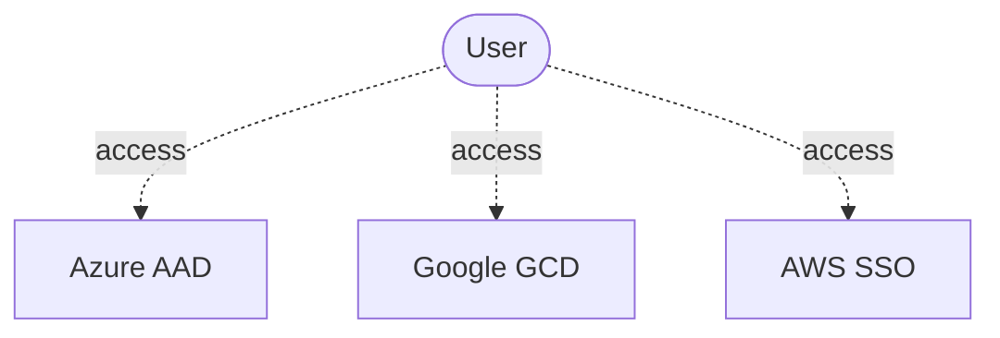
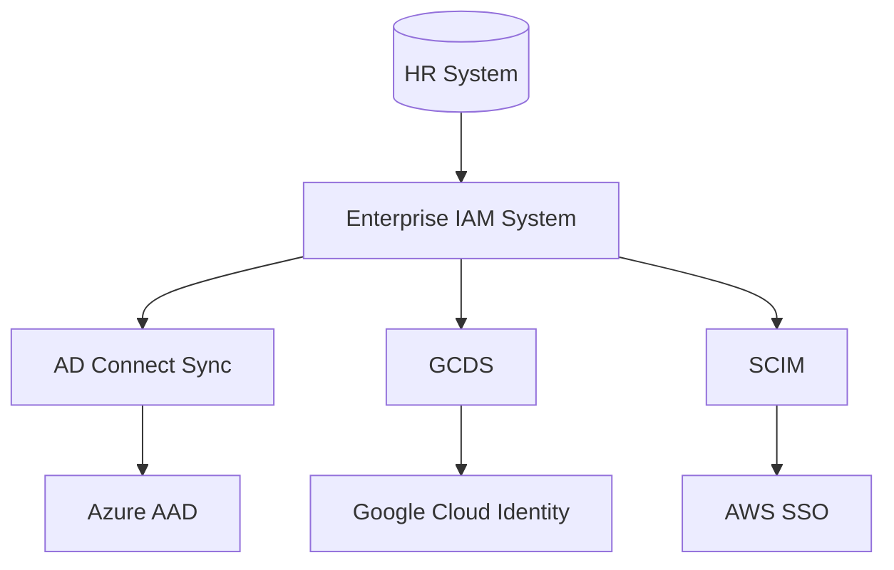
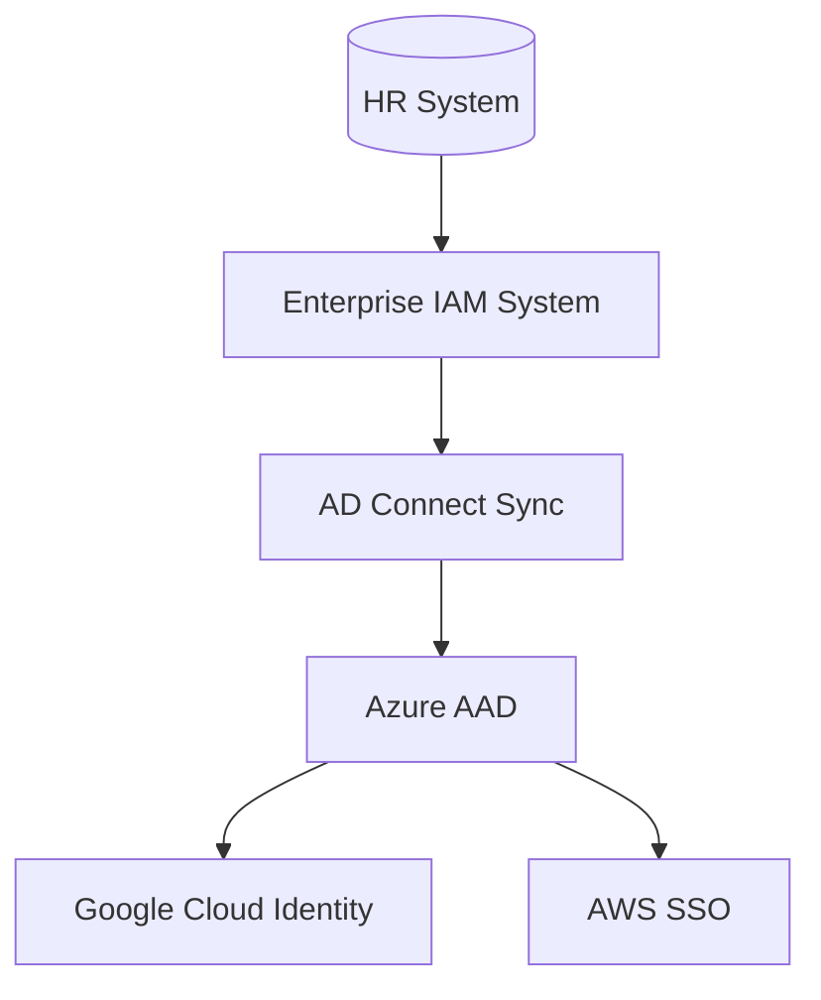

## What Is Identity Lifecycle Management?

User Identity refers to an electronic identity utilized for interaction with software. Each user needs user identity to access a cloud provider as shown below:

The system **ascertains** the user’s **identity**, usually through a combination of **user name** and **password** or by retrieving **biometric data** (*authentication*). The established *identity* is associated with certain **access rights** (*authorization*).

Identity Lifecycle Management refers to the process of managing these user identities and evolving access privileges of employees throughout their work tenure. An identity lifecycle management solution automates and simplifies the processes associated with onboarding and offboarding users, assigning and managing access rights, and monitoring and tracking access activity. Identity Lifecycle Management aims to automate and manage the entire digital identity lifecycle process. 

***So, what is digital iden******tity******?*** It is information on an entity used by one or more operating systems or applications. These entities may represent people, organizations, technical users or IT devices. The identity is usually described by the attributes that are associated with it, such as the name, identifiers, as well as properties such as roles used for access management. 

## Why We Need Identity Lifecycle Management?

Many corporate IT and security organizations rely on inefficient manual processes to provision new users and manage their privileges. It can take days (or even weeks in some businesses) to onboard new hires and give them secure access to the applications and IT systems..

Many businesses may have automated processes, for deprovisioning privileges or deactivating user accounts as workers take on new roles or exit the company, but they may not have IT systems integrated with central Identity and Access Management (IAM) systems. As a result, stale accounts often remain in place long after employees leave the business or change positions, which is a GDPR violation.

Identity lifecycle management solutions overcome these challenges by automating manually intensive and error-prone user provisioning and identity governance processes. They help improve employee productivity by allowing new hires access to their applications and IT services from the very first day. They help IT and security organizations free up staff to focus on more important tasks to support the business.

## Organizational Perspective

When planning identity lifecycle management for employees many organizations model the "join, move, and leave" process, which is explained below:

- **Join** - when an individual needs access, an identity is needed by those applications, so a new digital identity may need to be created if one is not already available

- **Move** - when an individual moves between boundaries, that require additional access authorizations to be added or removed to their digital identity

- **Leave**- when an individual leaves the scope of needing access, access may need to be removed, and subsequently the identity may no longer be required by applications

## Best Practices for Implementing Multi-Cloud Identity Lifecycle Management

### Leverage Directory Synchronization with a Star Topology

The following shows an example of high-level architecture for multi-cloud identity life cycle management. You can access the cloud platforms as shown below. Most organizations rely on an Active Directory (AD) or LDAP on-premise system as a central user directory. Enterprise IAM Systems allows users to access this central directory and assists in the following: 

- Integrating HR workflows and master data for smooth user onboarding and off-boarding.

- Approving workflows like providing approvals for various processes or roles

#### Azure 

Azure uses Azure AD (AAD) as its IAM systems. Organizations that want to leverage Azure must bring their identities into AAD, so that developers can work with Azure. Currently it provides these features:

- Users representing employees can be automatically created and updated in Azure AD and Active Directory using [HR-driven provisioning](https://docs.microsoft.com/en-us/azure/active-directory/app-provisioning/what-is-hr-driven-provisioning)

- Users already present in Active Directory can be automatically created and maintained in Azure AD using [inter-directory provisioning](https://docs.microsoft.com/en-us/azure/active-directory/hybrid/what-is-inter-directory-provisioning)

- Users can be automatically assigned to groups based on their properties, using [dynamic groups](https://docs.microsoft.com/en-us/azure/active-directory/external-identities/use-dynamic-groups#what-are-dynamic-groups) and can, upon request, be assigned to groups, Teams, Azure AD roles, Azure resource roles, and SharePoint Online sites, using [entitlement management](https://docs.microsoft.com/en-us/azure/active-directory/governance/entitlement-management-scenarios) and [Privileged Identity Management](https://docs.microsoft.com/en-us/azure/active-directory/privileged-identity-management/pim-configure)

- Updates to users can be automatically sent to more applications using [app provisioning](https://docs.microsoft.com/en-us/azure/active-directory/app-provisioning/user-provisioning)

To implement sync, customers use the [Azure Active Directory Connect synchronization ](https://docs.microsoft.com/en-us/azure/active-directory/hybrid/how-to-connect-sync-whatis)services (Azure AD Connect sync). It is a main component of Azure AD Connect. It takes care of all the operations that are related to synchronizing identity data between your on-premises environment and Azure AD.  

#### Google Cloud 

Google uses Cloud Identity. Organizations that want to leverage Google must bring their identities into Cloud Identity, so that developers can work with Google. Identity lifecycle management—the ability to automatically add and remove users to applications—is one of the key features of [Cloud Identity](https://cloud.google.com/identity). Google Cloud’s identity, access and device management solution, is available as a standalone solution. For more details, please refer to the topic [**Cloud Identity and Atlassian Access.**](https://cloud.google.com/blog/products/identity-security/cloud-identity-and-atlassian-access-user-lifecycle-management-across-your-organization)

To implement sync, customers use [Google Cloud Directory Sync (GCDS)](https://cloud.google.com/architecture/identity/federating-gcp-with-active-directory-synchronizing-user-accounts).

#### AWS 

AWS uses AWS SSO. Organizations that want to leverage AWS can do so for an organization-level directory like AAD or Google Cloud Identity. For greater security and organization, you can give access to your AWS account to specific users—identities that you create with custom permissions. You can further simplify access for those users by federating existing identities into AWS. For more details, please refer to the topic [**Overview of AWS identity management**](https://docs.aws.amazon.com/IAM/latest/UserGuide/introduction_identity-management.html)**.**

To implement sync to AWS SSO, customers use SCIM. This means their enterprise IAM system needs to be capable of SCIM. In this SCIM environment, identity providers and service providers can constantly communicate despite barriers such as organization-imposed firewalls, making SCIM provisioning the ideal protocol for seamless integration. You can also use AAD or Google Cloud Identity for SCIM, however that creates a two stage process

### Avoiding Multi-Stage Synchronization Processes

Sometimes it’s not possible for organizations to sync users directly from an on-premise Enterprise IAM System to the cloud, because the Enterprise IAM System does not support SCIM protocol or it resides in a closed network perimeter without internet access.

One way to overcome this limitation is to first sync the on-premise directory to an authoritative “cloud directory”. And then, the process syncs this cloud directory to other cloud directories.

One significant downside of this architecture is the increased complexity of the sync process. Since, user lifecycle events need to propagate through multiple stages, the sync can become brittle and incomplete very quickly. Identity attributes for example have to be carefully mapped and preserved through multiple layers to ensure that directories at the end of the chain receive high quality identity data. Preserving attributes through every stage is not always possible, because directories have different representations of attributes and technical limitations (e.g. length, character sets) for storing them.

Another disadvantage is the propagation delay due to sync cycles adding up. This is especially critical for user deletion, because many directories implement a suspension/soft-deletion process. Administrators need to carefully configure these processes along each step of the chain to achieve reliable identity deprovisioning.

#### What Does Sync Groups Refer To? 

A fundamental pre-requisite for these federated identity architectures is to determine the set of identities to synchronize to cloud directories. The best practice is to avoid syncing the whole on-premise directory, as this needlessly distributes personally identifiable information (PII) and violates "need to know" principles.

Only a subset of identities managed in an on-premise IAM system is relevant to a cloud foundation. Typically, the relevant set includes IT staff working on cloud-related projects and excludes general office staff. This brings us to the topic of  "sync group", which is a group of users who have been given access to a tenant via your Cloud Foundation Platform. 

