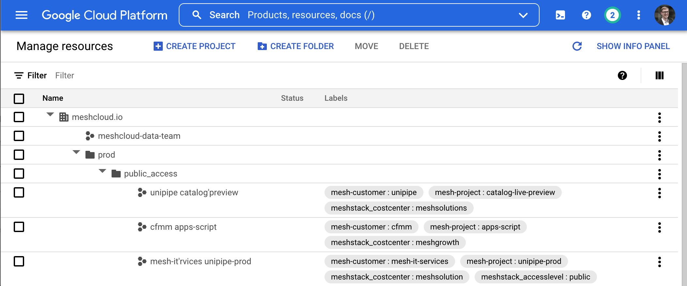

Tagging cloud tenants deliberately simplifies the cloud foundation team’s operational procedures for administering a cloud platform. Tags store important metadata about a cloud tenant directly in the cloud platform’s control plane.

> **💡** Cloud platforms can use different terms for tags like labels or annotations. The Cloud Foundation Maturity Model refers to tags as any mechanism that allows attaching a custom **key-value** pair to a cloud tenant or resource.

Control panels like the Azure or Google Cloud Console display this metadata directly. This can simplify operations significantly because operators have key information immediately available.

Most cloud platforms offer APIs to read the metadata which allows the cloud foundation team to develop or build reporting automations or similar. Some platforms also enable users to create reports and dashboards for tagged cloud resources based on the metadata by providing tools, CLIs, or other native services. 

Tagging can thus facilitate security & compliance automation scenarios. For example, an [Incident Management Process](./incident-management-process.md) can automatically classify criticality of detected incidents based on a tenant tag indicating whether the tenant is used productively or as a development/staging environment.

## Tagging Is a Foundation for Good Cloud Management

Since tagging with key-value pairs is such a basic mechanism, cloud foundation teams can leverage their flexibility to implement many different cloud foundation capabilities. For example, tenant tagging can help implement a basic [Chargeback via consumption cost allocation](../cost-management/chargeback-via-consumption-cost-allocation.md) by assigning a `costCenter:` tag to each AWS Account. At the same time, tagging a cloud tenant with `owner: alice@example.com` can enable security and compliance processes like [Incident Management Process](./incident-management-process.md). However, this means that many different requirements and stakeholders may place demands on tagging. This can create conflicting requirements. That’s why cloud foundation teams need to establish a clear strategy for tags and their use.

<!--notion-markdown-cms:raw-->
 <CallToAction>
  <CtaHeader>A Winning Tagging Strategy</CtaHeader>
  <CtaText>Tagging and labeling is an early stage topic of your cloud journey. It forms the foundation of secure and structured growth.</CtaText>
  <CtaButton class="btn-primary" url="https://www.meshcloud.io/2020/10/27/your-path-to-a-winning-multi-cloud-tagging-strategy/">Learn more about Tags</CtaButton>
</CallToAction>

### Consistent Tagging Is a Matter of Compliance

While cloud tenant tagging enables a basic implementation of many other cloud foundation building blocks, Cloud Foundation teams should treat adherence to the established tagging strategy as a matter of compliance. This is why the Cloud Foundation Maturity Model puts this building block into the Security & Compliance pillar, as opposed to putting it in the Tenant Management or Cost Management pillar.

### Tag the Most Useful Subset of Tenant Metadata

The key advantage of cloud tenant tagging is that it makes important metadata about a cloud tenant available directly in the cloud platforms. This means that a human operator or cloud-native automation does not have to interact with a separate [Cloud Tenant Database](../tenant-management/cloud-tenant-database.md) to retrieve important tenant metadata. However, cloud tenant tagging is rarely a sufficient solution for storing all required metadata about a cloud tenant due to their technical limitations.

> **💡** Cloud Tagging needs to be consistent. Establish **authoritative sources** for each tag and clarify responsibilities for keeping the tag value up to date.

As Cloud Foundations mature, they also often find the need to implement self-service capabilities to maintain tenant metadata, e.g. using a [Self-Service Multi-Cloud Tenant Database](../tenant-management/self-service-multi-cloud-tenant-database.md). This is difficult to implement when relying on cloud-native tagging APIs because their permissions are not fine-granular enough to distinguish “customer update-able tags” from “authoritative tags”. This can lead to inconsistent or incorrect tagging. 

## Best Practices for Cloud Tenant Tagging

### Understand the Difference between Tenant and Resource Tagging

Most cloud platforms have tagging facilities that can cover the Tenant and Resource level of the [Resource Hierarchy](../tenant-management/resource-hierarchy.md). Cloud Foundation teams should treat **tenant tags** as the preferred solution for tags that should apply consistently to all resources in a tenant. For example, when tagging a cloud tenant as `stage: production`, tagging individual cloud resources inside the tenant with the same tag should not be necessary. Having the tag stored in a single place at a higher level in the resource hierarchy simplifies managing and updating the tag. Since the cloud foundation team is already responsible for Tenant Management, it should typically also assume responsibility for tenant tagging. 

[Cloud Resource Tagging](./cloud-resource-tagging.md) is useful for resources that need to be **individually tagged**, for example when labeling cloud resources storing personally identifiable information (PII). This responsibility best resides with the cloud foundation’s customers.

### Tag Consistently

To get the most benefit out of tagging cloud tenants, cloud foundation teams should set clear expectations and guidelines for the name and values of tags. These guidelines are often called a “tag catalog” or “cloud tagging policy”.  The building block [Multi-Cloud Tagging Policy](./multi-cloud-tagging-policy.md) covers this capability.

Inconsistent (or even worse -  incorrect) tagging severely limits the opportunities for building on tagging data for building higher-level cloud foundation capabilities. For example, taking a risk-based automation approach based on `stage` for [Tenant Deprovisioning / Decommissioning](../tenant-management/tenant-deprovisioning-decommissioning.md) or classifying incident severity in an [Incident Management Process](./incident-management-process.md) becomes impossible when the cloud foundation team can’t trust that each tenant is consistently tagged with the correct `stage` value. 

### Consider a Multi-Cloud Tagging Strategy

Cloud Tenant Tagging is a platform-scoped building block in the cloud foundation maturity model. Cloud Foundation teams following a multi-cloud strategy should look into [Multi-Cloud Tagging Policy](./multi-cloud-tagging-policy.md) to implement consistent tagging across all cloud platforms at the core scope.

### Understand Tagging Limitations of Cloud Platforms

Most cloud platforms impose technical limitations on the use of tags. Cloud Foundation teams should be aware of the following restrictions

- **Limited number of tags**: Azure and AWS limit the number of tags to a maximum of 50 tags per tenant

- **Limited length**: Platforms can limit the length of key/value pairs, sometimes as short as 64 characters

- **Restricted character-set:** Most platforms only support alpha-numeric characters, with a few exceptions for punctuation characters

- **Restricted words:** Some platforms forbid the use of certain keywords, e.g. the `aws:` prefix

<!--notion-markdown-cms:raw-->
 <CallToAction>
  <CtaHeader>Cloud Tagging Cheat Sheet</CtaHeader>
  <CtaText>For a detailed overview of platform tag limitations and comparison of allowed tags have a look at this tagging cheat sheet.</CtaText>
  <CtaButton class="btn-primary" url="https://www.meshcloud.io/2022/02/07/tags-and-labels-on-cloud-platforms-cheat-sheet-2020/">View Tagging Cheat Sheet</CtaButton>
</CallToAction>

### Automating Cloud Tenant Tagging

Since consistency is crucial for making a cloud tenant strategy useful, cloud foundation teams should aim for a high degree of automation when implementing this building block. Most teams will initially start with a **manual** tagging approach e.g. by manually setting tenant tags during [Tenant Provisioning](../tenant-management/tenant-provisioning.md). Automation of the provisioning process also enables **semi-automated tagging.** To ensure consistent tenant tagging for the entire cloud tenant lifecycle, cloud foundation teams should also enable self-service updates of tags, for example by leveraging a [Self-Service Multi-Cloud Tenant Database](../tenant-management/self-service-multi-cloud-tenant-database.md) with automated reconciliation of tenant tags to achieve **full tagging automation.**

