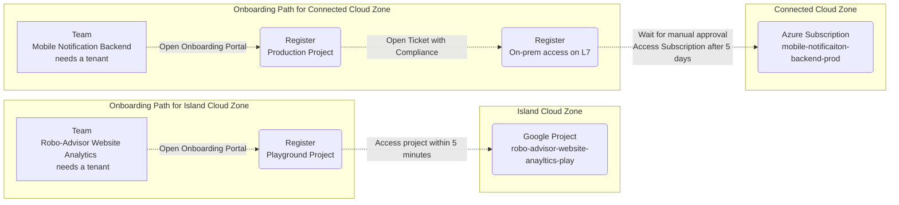
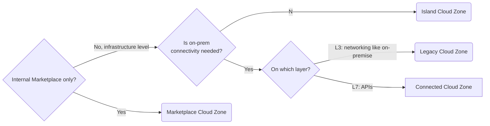

The cloud is about having a single interface for everything DevOps teams need to be productive. The Cloud Foundation is building up this interface for services in the five pillars of the Cloud Foundation Maturity Model. To maximize productiveness, those services must be available as fast as possible. However, regulations have to be followed, even for the cloud. It should therefore not come as a surprise that some enterprises struggle more than others with reducing the time-to-cloud. For example, DevOps teams in the Finance and Healthcare industry must often meet a long list of regulatory requirements before accessing the cloud. But even in those industries, not all onboarding steps are necessary for all use cases. 

For this reason, Cloud Foundation teams divide their service offerings into Cloud Zones with corresponding cloud onboarding paths. Only after following an onboarding path customers are allowed to consume services of a Cloud Zone. Cloud Zones shorten time-to-cloud for a majority of use cases compared to one-size-fits-all onboarding paths.

> **💡** DevOps teams must follow the Cloud Onboarding Path of a Cloud Zone before consuming services of this Cloud Zone.

**Example onboarding paths:** Compare two different teams at the imaginary likvid bank.

- The newly founded DevOps team “Mobile Notification Backend” needs a cloud tenant to run their application in production. The Notification Backend system needs an [On-Premise Network Connection](../service-ecosystem/on-premise-network-connection.md) on layer 7. This access must be registered and approved by the Compliance department. The approval may take up to 5 business days. The application’s tenant will be in the “Connected” Cloud Zone.

- In contrast, the DevOps team “Robo-Advisor Website Analytics” wanted to explore the Analytics options of GCP in a [Playground / Sandbox Environments](../tenant-management/playground-sandbox-environments.md). It did not need on-prem connectivity. Therefore their cloud onboarding did not include the step for registering on-prem connectivity. No manual sign-off was needed and  [Tenant Provisioning](../tenant-management/tenant-provisioning.md) happened within minutes. The tenant is in the “Island” Cloud Zone.

## How to Implement Cloud Zones

> **💡** Finding Cloud Zones is an exercise that demands a good knowledge of the regulatory landscape and the Cloud Foundation service offering. 

1. Write down all steps for cloud onboardings that are needed to meet regulatory requirements.

    **Example steps**

    - register application in CMDB with responsible persons

    - register L3 level on-prem connectivity

    - get approval by the compliance department for L3 level on-prem connectivity

1. Define Cloud Zones along with common use-cases. Every Cloud Foundation customer must fit into exactly one Cloud Zone.

    **Example Cloud Zones**

    - Customers who only consume services from the[Internal Service Marketplace](../service-ecosystem/internal-service-marketplace.md) and do not need infrastructure level access.

    - Customers who need infrastructure level access without [On-Premise Network Connection](../service-ecosystem/on-premise-network-connection.md).

    - Customers that need a tenant with [On-Premise Network Connection](../service-ecosystem/on-premise-network-connection.md) on L3

        - in dev

        - in prod

    - Customers that need a tenant with [On-Premise Network Connection](../service-ecosystem/on-premise-network-connection.md) on L7

        - in dev

        - in prod

1. For every Cloud Zone, write down a Cloud Onboarding Path as an ordered list of steps.

1. Put controls in place to ensure compliant usage of Cloud Zones. That means, only customers that followed a Cloud Onboarding Path are allowed to. The capability to [Control access to cloud platforms and Landing Zones](./control-access-to-cloud-platforms-and-landing-zones.md) is needed.

## Best Practices around Cloud Zones

<!--notion-markdown-cms:raw-->
<CallToAction>
  <CtaHeader>Speed up your cloud migration</CtaHeader>
  <CtaButton class="btn-primary" url="https://www.meshcloud.io/use-case-cloud-zones/">Tell me more about Cloud Zones</CtaButton>
</CallToAction>

### Keep It Simple

The “your application stage (dev, prod) is your Cloud Zone” approach might be sufficient for your enterprise.

### Help DevOps Teams Pick the Right Cloud Zone

Cloud Foundation teams guide their customers to the right Cloud Zone. Common implementations are a decision tree diagram on a Wiki page or an interactive assessment on the [Guided Cloud Onboarding](./guided-cloud-onboarding.md).

### Tag Every Application with Its Cloud Zone

Store the Cloud Zone as tenant tags for security and cost analysis per Cloud Zone. Make Cloud Zones part of [Multi-Cloud Tagging Policy](./multi-cloud-tagging-policy.md).