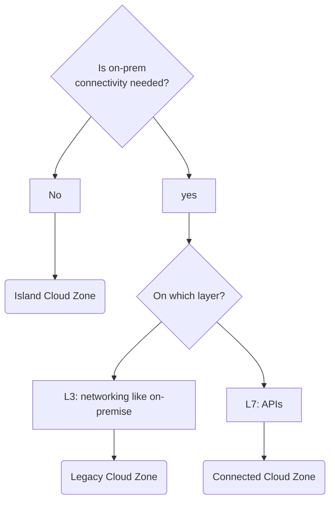

Enterprises in heavily regulated industries like finance and healthcare must ensure that DevOps teams meet regulatory requirements before accessing cloud tenants and services. But not all onboarding steps are necessary for all use cases. Cloud Foundation teams offer tailored onboarding paths that lead to different Cloud Zones to make onboarding as easy as possible. Cloud Zones allow better time-to cloud often for a matority of use cases than one-size fit all cloud onboardings.

**Example**: Compare the onboarding paths of two different teams at the imaginary likvid bank.

- The newly founded DevOps team “Mobile Notification Backend” needs access to a cloud tenant for development. The Notification Backend system needs access to on-prem systems, which needs to be registered during onboarding. This entails a manual risk assessment and sign-off from the Compliance department that may take up to 5 business days. The application will run in the “Connected” Cloud Zone.

- In contrast, the DevOps team “Robo-Advisor Website Analytics” wanted to explore the Analytics options of GCP in a [Playground / Sandbox Environments](/maturity-model/tenant-management/playground-sandbox-environments.md). It did not need on-prem connectivity. Therefore their cloud onboarding did not include the step for registering on-prem connectivity. No manual sign-off was needed and  [Tenant Provisioning](/maturity-model/tenant-management/tenant-provisioning.md) happened within minutes. The environment is located in the “Island” Cloud Zone.

## Proven Patterns When Implementing Cloud Zones

### Collect All Onboarding Steps to Derive Cloud Onboarding Paths

1. Write down all steps that are needed for cloud onboardings

1. 

### Provide Guidance for Choosing the Right Cloud Zone

Cloud Foundation teams guide their customers to the right Cloud Zone. Common implementations are a decision tree diagram on a Wiki page or an interactive assessment on the [Onboarding Portal](/maturity-model/security-and-compliance/onboarding-portal.md).

### Guard Cloud Zones

