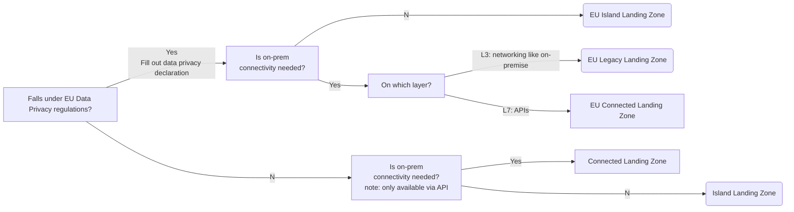

Cloud Foundation teams strive to help application teams move to the cloud smoothly without neglecting compliance and security. To meet organizational compliance demands, Application teams usually have to meet a set of requirements before accessing the cloud.

When it comes to controlling access to something, one needs to ask “who” gets access and to “what”. Application teams (“who”) need to work within Landing Zones like [Lift & Shift Landing Zone](../tenant-management/lift-and-shift-landing-zone.md) or [Container Platform Landing Zone](../tenant-management/container-platform-landing-zone.md) when building their application. Landing Zones are therefore a natural fit for the “what” in controlling access.

#### Example

Workload processing data subject to EU Data Privacy regulations needs to be handled differently in likvid bank. Furthermore, the connectivity needs of an application has consequences on the Landing Zone an application can be placed in. 

Likvid Bank application team are following a [Guided Cloud Onboarding](./guided-cloud-onboarding.md) that helps to decide on a Landing Zone and leads through necessary regulatory steps.

Application teams can only start consuming EU Landing Zones after the data privacy declaration has been filled out and archived. 

## Best Practices When Implementing Access Controls to Landing Zones

To arrive at a simple model for controlling access, classify application team use-cases along common requirements as described in [Guided Cloud Onboarding](./guided-cloud-onboarding.md).

