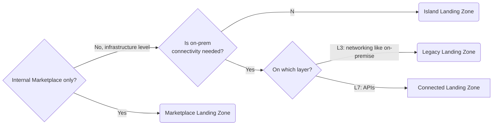
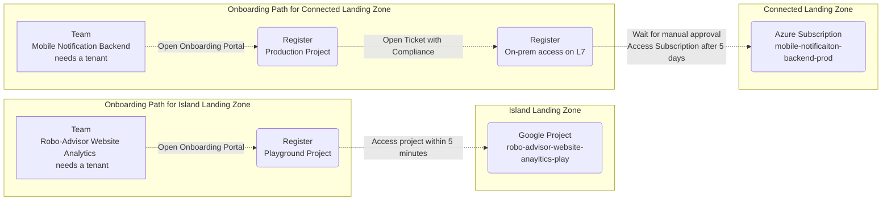

Guided Cloud Onboarding is about helping application teams move to the cloud as smoothly as possible by reducing cognitive load and reducing the number of steps to a minimum.

A cloud onboarding can be as simple as signing into [Self-Service Multi-Cloud Tenant Database](../tenant-management/self-service-multi-cloud-tenant-database.md), choosing between Landing Zones, agreeing to the Shared Responsibility Model and provisioning your first tenant within minutes. Application teams in regulated industries, such as Finance and Healthcare, must often meet a long list of regulatory requirements before accessing the cloud. This can include activities such as getting approvals from other departments or creating entries in CMDB or IAM systems. Regardless of the complexity, a guided cloud onboarding ensures that customers have an overview over where they are in their cloud onboarding journey and what comes next. 

## Best Practices

### Start Simple

While you can build a lot to make onboarding even smoother for your customers, we recommend to start simple.

Start a wiki area for your team. Write a guide “How to access the cloud at <company>” and advertise this wiki page with your customer. This has multiple benefits:

1. Application teams are made aware that there is a standard process for cloud onboarding.

1. Having all steps laid out makes the process transparent for the customer, leading to less friction then back-and-forth-emailing.

### Help Applications Teams to Pick the Right Landing Zone

Cloud Foundation teams should provide material to guide their customers to the right Landing Zone. Common implementations are a decision tree diagram on a Wiki page or an interactive assessment.

### Lay out Multiple Cloud Onboarding Paths

If regulatory requirements for some Landing Zones are much higher than for other Landing Zones, Cloud Foundation customers can benefit from multiple cloud onboarding paths. Multiple onboarding paths may shorten time-to-cloud for a majority of use cases compared to one-size-fits-all onboardings.

**Example with two onboarding paths:** Compare two different teams at the imaginary likvid bank.

- The newly founded application team “Mobile Notification Backend” needs a cloud tenant to run their application in production. The Notification Backend system needs an [On-Premise Network Connection](../service-ecosystem/on-premise-network-connection.md) on layer 3. This access must be registered and approved by the Compliance department. The approval may take up to 5 business days. The application’s tenant will be in the “Connected” Landing Zone.

- In contrast, the application team “Robo-Advisor Website Analytics” wanted to explore the Analytics options of GCP in a [Playground / Sandbox Environments](../tenant-management/playground-sandbox-environments.md). It did not need on-prem connectivity. Therefore their cloud onboarding did not include the step for registering on-prem connectivity. No manual sign-off was needed and  [Tenant Provisioning](../tenant-management/tenant-provisioning.md) happened within minutes. The tenant is in the “Island” Landing Zone.

## How Design a Guided Cloud Onboarding with Multiple Onboarding Paths

The idea is to find a small set of use-case requirements that allow to build a decision tree for a guided cloud onboarding.

> **💡** Clustering use-cases by requirements is an exercise that demands a good knowledge use-cases as well as regulatory requirements that affect those use-cases. 

1. Cluster application teams by common use-case requirements and leverage these clusters to build tailored landing zones.

    **Common Use-Case Requirements**

    - **confidentiality:** Processing confidential data is often only allowed after accepting a higher degree of responsibility in the Shared Responsibility Model or working in a more constrained environment.

    - **legal zones:** Regulated industries like the financial industry can be required to segregate regulated from non-regulated IT systems. This can also intersect with organizational boundaries like different legal entities belonging to your organizations, though you should cautiously avoid [coupling your org chart to the cloud resource hierarchy](https://cloudfoundation.org/maturity-model/tenant-management/resource-hierarchy.html#decouple-cloud-resource-hierarchy-from-your-org-chart).

    - **connectivity:** Perimeter based networking security stands in contrast to zero-trust models. 

    - **stage:** An application team usually runs their application in multiple stages. While production workloads are relevant for audit, this might not be true for development workloads.

1. Write down all steps for cloud onboardings that are needed to meet regulatory requirements per landing zone

    **Example steps**

    - register application in CMDB

    - register L3 level on-prem connectivity

    - get approval by the compliance department for L3 level on-prem connectivity

1. For every landing zone, write down a Cloud Onboarding Path as a list of steps.

1. Restrict landing zone consumtption to customers that followed the corresponding onboarding path. The capability to [Control Access to Landing Zones](./control-access-to-landing-zones.md) is needed here.

