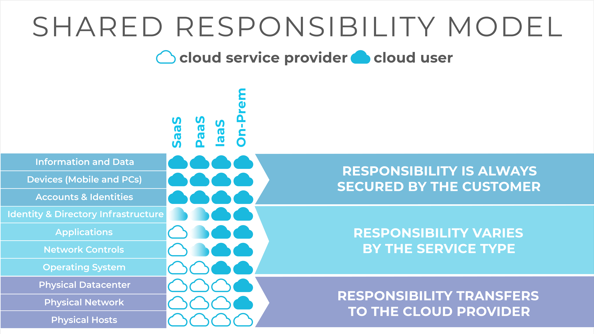

## What is the Shared Responsibility Model

The common known shared responsibility model definition explained by cloud providers like AWS, GCP or Azure are not sufficient to enable a success story for enterprises as it does not take into account customer internal structures and organizations at all. Every successful cloud-native organization[?] has defined an agreed-on holistic shared responsibility model.

The foundation of a well-defined cloud-native organization is the documentation of the shared responsibility model as well as further information for other stakeholders. This is implemented usually in form of an documented internally shared wiki like Confluence.

The minimum participants in an shared responsibility model are the cloud providers and DevOps teams as responsible parties. In practice shared teams - like CCoE (Cloud Center of Excellence), Cloud Foundation, Central IT or infrastructure teams - are also involved and need to be considered when defining your own organisations shared responsibility model.

<!--notion-markdown-cms:raw-->
<CallToAction>
  <CtaHeader>Structure your clouds</CtaHeader>
  <CtaText>Check out meshcloud’s white paper “<b>Best Practices of Modeling your Organizational Structure in the Cloud</b>” as an introduction to organizational design in the cloud.</CtaText>
  <CtaButton class="btn-primary" url="https://www.meshcloud.io/best-practices-organizational-structure-in-the-cloud/">Tell me about structuring my clouds</CtaButton>
</CallToAction>

The shared responsibility model by cloud providers like AWS, Azure or GCP - only shows the model from the external perspective. In general the models describe the responsibility of the Cloud Provider and the consumer party (you). In short the model defines a responsibility border based on the service offering:

- The Cloud provider is responsible for the provided infrastructure up to the service or application itself depending on the service offering model - SaaS, PaaS, IaaS

- The Consumer party is responsible from the Operating System to the (virtual) networking up to their own data moving to the cloud depending on the consumed service offering model

The shared responsibility model is therefore defined based on the service from the cloud provider. Observable from experience, this is not sufficient, because it does not take into account how your organisation is setting itself up for a successful cloud journey, namely by building a cloud foundation.

In general if a company or an enterprise approaches one or multiple cloud adoption a dedicated team is assembled - which can include stakeholder from all kinds of other teams and departments like networking, infrastructure and security. This assembled team is what will be referred as the **Cloud Foundation team**. The team also usually discuss relevant aspects of the cloud adoption internally e.g. with the IAM, Security Team, Governance Risk and Compliance, Infra. Team, ITSM Team, Controlling, etc. They also usually work together with specialist for each of the cloud providers to clarify their problem scope, questions and various other things. Especially of interest to the cloud foundation team is how the shared responsibility is implemented for various services as well as how to secure their cloud for their responsible parts.

This Cloud Foundation is responsible for the cloud transformation within the enterprise. While the size and some of the responsibilities of the teams vary from enterprise to enterprise the central tasks is the same - bringing the enterprise successfully and secure to the cloud (Cloud Journey).

In general the enterprise wants to achieve the “optimized usage of the cloud to adopt the the market better, faster and cost efficient” from where the cloud foundation team derive their operative goals like:

- Better cost control and cost management of the cloud usage

- Accelerating the usage of cloud within the enterprise

- Offering a secure baseline for the cloud usage

- and many others

The Cloud Foundation team tends to be the first point of contact in regards to cloud related topics - therefore it supports other teams (their internal customers) regarding topics like integration of services and platforms. They are the internal anchor point for the cloud journey.

The Cloud Foundation teams needs to consider the following point when defining their own shared responsibility model:

- Know your stakeholder - it is of foremost importance to know who interested parties and active participants are. Why not use a Stakeholder Map for this?

- Define and describe the approached organisational structure. It may be helpful to you to read the whitepaper “Cloud Organization”?

- Define clear boarders - it must be clear to anyone internal “who is responsible for what”

