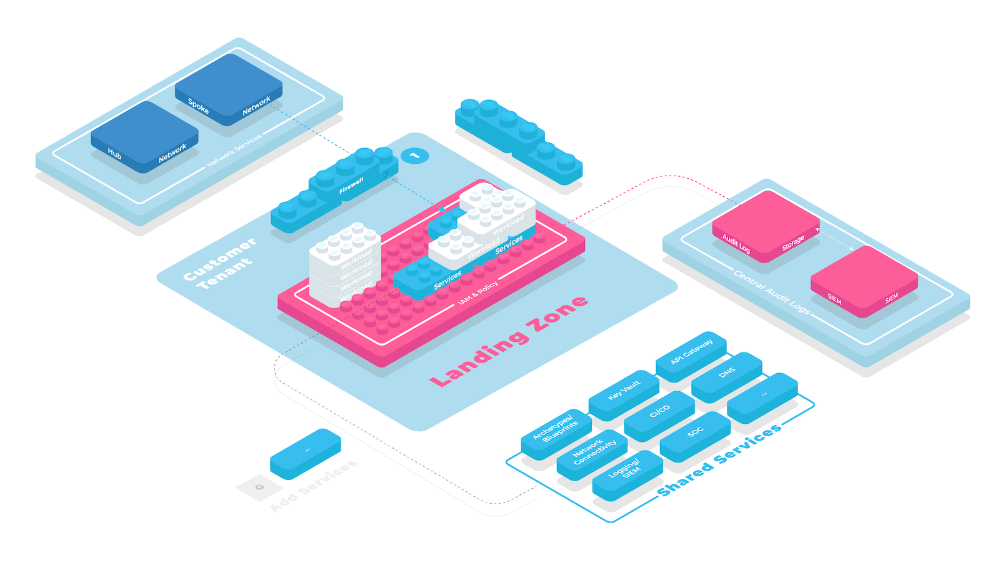

A Landing Zone prescribes the configuration of cloud tenants used by application teams. To enforce a mandatory baseline configuration, cloud foundation teams need to ensure they configure tenants during [Tenant Provisioning](./tenant-provisioning.md) and before handing them over to application teams. 

Modular Landing Zones start with a mandatory security baseline like [Service and Location Restrictions](../security-and-compliance/service-and-location-restrictions.md) and [Resource Authorization Management](../iam/resource-authorization-management.md). On top of this baseline, they offer optional modules that enable application teams to tailor their cloud environment to their needs as shown in the figure below.

## Modular Landing Zones Enables Scaling

Early stage cloud foundations often start with a “one size fits all” approach to Landing Zones which we call “monolithic landing zones”.

> **⛈️** **Monolithic landing zones** include mandatory resources like virtual networks managed with the same life-cycle as the underlying cloud tenant. While this makes them simpler to build initially, they offer little room to grow with the needs of your application teams. 

For example the landing zone may include a prescriptive network configuration for enabling [On-Premise Network Connection](../service-ecosystem/on-premise-network-connection.md) as well as mandatory audit setting up [Centralized audit logs](../security-and-compliance/centralized-audit-logs.md). When the Cloud Foundation team encounters a new concern, like enabling application teams to use a [Managed DevOps Toolchain](../service-ecosystem/managed-devops-toolchain.md), they have to add the new service to the existing baseline. 

Already a small number of optional modules can lead to a large number of combinations of those modules. Modular Landing Zones allow tailoring Landing Zones to the needs of every application  team while keeping redundancy low and complexity manageable.

<!--notion-markdown-cms:raw-->
<CallToAction>
  <CtaHeader>Secure your Cloud Accounts across all Clouds</CtaHeader>
  <CtaText>Having large numbers of accounts with multiple cloud providers requires an airtight management solution: The creation, administration, security configuration and deprovisioning has to be easy and transparent.</CtaText>
  <CtaButton class="btn-primary" url="https://www.meshcloud.io/2020/06/08/cloud-landing-zone-lifecycle-explained/">Learn more</CtaButton>
</CallToAction>

## Proven Patterns for Building Modular Landing Zones

### Split up Existing Monolithic Landing Zones

If you already built a monolithic landing zones you do not have to start from scratch but split it up into individual modules instead. When splitting up existing Landing Zones, a general guideline is: Policies and security settings go into the Landing Zone baseline. Infrastructure that requires deploying cloud resources like [Managed Key Vault](../service-ecosystem/managed-key-vault.md) or [Virtual Network Service](../service-ecosystem/virtual-network-service.md) should go into modules.

### Use a Cloud Foundation Platform

Cloud Foundation teams need control over who gets access to what Landing Zone (see [Control access to cloud platforms and Landing Zones](../security-and-compliance/control-access-to-cloud-platforms-and-landing-zones.md)). At the same time, a low time-to-cloud is only sustainable via self-service onboarding for application teams (see [Self-Service Multi-Cloud Tenant Database](./self-service-multi-cloud-tenant-database.md) ). Therefore a highly integrated solution is necessary for applying a baseline of Landing Zones to application teams while also offering a [Foundation Service Platform](../service-ecosystem/foundation-service-platform.md) for the optional landing zone modules. A Cloud Foundation Platform that integrates both aspects helps cloud foundation team manage all the required plumbing for enabling modular landing zones.

### Use Infrastructure as Code Tooling

Most teams build the optional modules for Landing Zones with Infrastructure as Code tooling. Common examples are Terraform, Azure BluePrint or Bicep, Google Cloud Resource Manager or AWS Cloud Formation.

### Manage Services GitOps Style

GitOps is a proven pattern for managing optional Landing Zones modules. Having easily accessible definitions of Infrastructure as Code files in a version control system makes inspecting and updating Landing Zones a lot easier. When integrating with Cloud Foundation Platforms that support Open Service Broker API for implementing Landing Zones modules, the open-source [UniPipe Service Broker](https://github.com/meshcloud/unipipe-service-broker/) can be used to implement a GitOps workflow.

### Find the Right Balance between Control and Freedom

Do application teams get IAM management rights in their tenant? An “open” approach to tenant permissions allows application teams to iterate faster. A “closed” approach minimizes risks stemming from misconfigured permissions.