Building a successful cloud foundation is a strategic undertaking. Since a cloud foundation is about building a single organisational capability to manage cloud adoption and consumption, it requires strong organizational alignment between different stakeholders. It therefore follows that the most successful approaches for building a cloud foundation seek to establish this alignment and productive collaboration from day one. However, this alignment between stakeholders may not be available from day one in your organization (see the Functional Pillars in [Why Cloud Foundation](/understanding-cloud-foundation/why-cloud-foundation.md) for an overview of stakeholders). While we see that the organizations most successful at cloud adoption are able to create and foster strong alignment between all involved functions, teams looking to build a cloud foundation can also iteratively build a cloud foundation while navigating the pitfalls created by lacking alignment.

The following sections are going to look at different strategies for building and maturing a cloud foundation in different settings.

## Stage by Stage

> 📌 Build cloud capabilities across all pillars evenly, progressing from essential to more advanced capabilities.

Cloud Foundation teams that have strong stakeholder alignment for all functional pillars, can implement capability building bocks evenly across all pillars.

```mermaid
flowchart BT;
  subgraph Tenant["🗂 Tenant Management"]
    TenantC1["⭐️"]-.->TenantC2["⭐️⭐️"]
  end
  subgraph IAM["🔐 IAM"]
    IAMC1["⭐️"]-.->IAMC2["⭐️⭐️"]
  end
  subgraph Services["🛠 Managed Services"]
    ServicesC1["⭐️"]-.->ServicesC2["⭐️⭐️"]
  end
  subgraph Compliance["🔖 Compliance"]
    ComplianceC1["⭐️"]-.->ComplianceC2["⭐️⭐️"]
  end
  subgraph Chargeback["💵 Chargeback"]
    ChargebackC1["⭐️"]-.->ChargebackC2["⭐️⭐️"]
  end
  Foundation["☁️ Cloud Foundation"]
  Foundation<-.->Tenant & IAM & Services & Compliance & Chargeback
```

<!-- unsupported block type: toggle -->

<!-- unsupported block type: embed -->

The Cloud Foundation Maturity model can help practioners identify the relevant capabilities in each pillar based on the **Journey Stage** (see [What is a Building Block](/plan/what-is-a-building-block.md) ). Cloud Foundation teams can use the journey stage to derive a recommended implementation order of capabilities.

### Advantages and Disadvantages

The advantage of this approach is that the team can consider interdependencies between capabilities in different pillars (e.g. from [Tenant Provisioning](/maturity-model/tenant-management/tenant-provisioning.md) to the [Identity and Access Management Concept](/maturity-model/iam/identity-and-access-management-concept.md) ) already in the earliest design stages. This means that the cloud adoption experience for DevOps teams is considered end-to-end from the start. Cloud Foundation teams can therefore avoid pitfalls like introducing media breaks and unnecessary manual handovers between process steps.

Another key advantage of this model is that the cloud foundation team can intentionally design the implementation of building blocks so that the solution architecture minimizes the number and complexity of technical interfaces between IT systems and processes. This decreases the overall solution complexity, resulting in higher agility and reduced operational maintenance cost to the organization.

With all these advantages as outlined before, the disadvantage of the "stage by stage" approach lies in the high organizational coordination required between pillars. This is difficult to create for many organizations where functions are used to work in silos. Cloud foundation teams need a lot of backing and decision making power to facilitate the required cross-functional mode of work.

### Building a Cloud Foundation Stage by Stage

To illustrate how the coordinated introduction of capabilities results in reduced complexity, and efficient development and maintenance cost, let's look at a practical example. Assume we have an team of Azure platform experts inside the Cloud Foundation team who start building a basic [Tenant Provisioning](/maturity-model/tenant-management/tenant-provisioning.md) process that allows DevOps teams to order Azure subscriptions for their projects. For the minimum-viable-product (MVP) of that process, they start keeping track of subscriptions and their owners with an Excel sheet on SharePoint, a very basic implementation of a [Cloud Tenant Database](/maturity-model/tenant-management/cloud-tenant-database.md) .

Of course our Azure experts are aware that the incurred subscription consumption cost has to be paid. Reaching out to the chargeback experts on their Cloud Foundation team, they figure out that they want to enable chargeback using a [Monthly cloud tenant billing report](/maturity-model/cost-management/monthly-cloud-tenant-billing-report.md) . Together with [Cloud Tenant Database](/maturity-model/tenant-management/cloud-tenant-database.md) , these two building blocks are on the essential ⭐️ cloud journey stage for their respective pillars.

Our cloud foundation team experts agree on a schema for budget metadata and add it to the cloud tenant database. Over the next month the team is seeing an increased demand for Azure subscriptions from the organization's internal customers. Maintaining that excel sheet has now become a chore. To provider a better service to their customers and ease their own operational burden, the cloud foundation team decides to build a [Self-Service Multi-Cloud Tenant Database](/maturity-model/tenant-management/self-service-multi-cloud-tenant-database.md) . This is a ⭐️⭐️  cloud journey stage capability. While developing the solution design, the team already considers that at some point they may want to add a [Budget Approval Process](/maturity-model/cost-management/budget-approval-process.md) to the self-service interface. As this is a ⭐️⭐️⭐️  cloud journey stage capability however, the team decides to tackle the actual implementation of that feature later.

## Pillar by Pillar

> 📌 Build cloud capabilities in each pillar in isolation with little coordination about interdependencies.

Organizations that lack stakeholder alignment for all functional pillars, or only have alignment for a subset of pillars, can resolve to building capabilities in pillars individually. This is a common mode of operation in many organizations that are just starting out their cloud journey and have not recognized the need for a Cloud Foundation team yet.

```mermaid
flowchart BT;
  subgraph Tenant["🗂 Tenant Management"]
    TenantC1["⭐️"]-.->TenantC2["⭐️⭐️"]
  end
  subgraph IAM["🔐 IAM"]
    IAMC1["🚫"]
  end
  subgraph Services["🛠 Managed Services"]
    ServicesC1["🚫"]
  end
  subgraph Compliance["🔖 Compliance"]
    ComplianceC1["🚫"]
  end
  subgraph Chargeback["💵 Chargeback"]
    ChargebackC1["⭐️"]
  end
  Foundation["☁️ Cloud Foundation"]
  Foundation<-.->Tenant & IAM & Services & Compliance & Chargeback
```

<!-- unsupported block type: toggle -->

<!-- unsupported block type: embed -->

The Cloud Foundation Maturity model can help practioners identify the relevant capabilities in each pillar based on the **Cluster** (see [What is a Building Block](/plan/what-is-a-building-block.md) ). Cloud Foundation teams can use the journey stage to derive a recommended implementation order of capabilities.

### Advantages and Disadvantages

One advantage is that pillars can start moving early and without stallignon allignemnt independently to provide cloud

The key **disadvantages** of this model are

- Media-breaks and manual handover between process steps for DevOps teams

- Gaps in Cloud Foundation capabilities due to "blind spots" in pillars owned by different stakeholders

- Increased complexity in the solution architectures due to evolutionary introduction of "point-to-point" or "process-to-process" interfaces as pillars try to individually implement building blocks.

- Increased cost for building and operating the cloud foundation due to the increased complexity.

### Building a Cloud Foundation Pillar by Pillar

To illustrate how the uncoordinated and isolated introduction of capabilities results in increased technical complexity, maintenance and development cost, let's look at a practical example. Assume we have an Azure platform team starts building a basic [Tenant Provisioning](/maturity-model/tenant-management/tenant-provisioning.md) process that allows DevOps teams to order Azure subscriptions for their projects. For that purpose they start keeping track of subscriptions and their owners with an Excel sheet on SharePoint, a very basic implementation of a [Cloud Tenant Database](/maturity-model/tenant-management/cloud-tenant-database.md) .

Of course our Azure Team is aware that *someone* has to pay for the incurred subscription consumption at the end of the day. However, the stakeholders responsible for IT chargeback are part of a different department and getting in touch with them is difficult. After a bit of back and forth, they located the responsible person who's processing the monthly Azure invoices. This person explains to them, that all Azure consumption is currently charged to a shared IT Cost pool. While our Azure Teams insists that it's not a good idea, they have to settle with this organization because improving the Azure chargeback process is currently not a priority to the finance and controlling department.

In the meantime, our Azure Team is getting more and more requests for subscriptions and maintaining that excel sheet has become a chore. To provider a better service to their customers and ease their own operational burden, the Azure team decides to build a [Self-Service Multi-Cloud Tenant Database](/maturity-model/tenant-management/self-service-multi-cloud-tenant-database.md) . Since the requirements for a chargeback process are unknown to them, capturing cost center and other billing-related data is not part of their solution.

During the next quarterly review the colleagues from finance and controlling start noticing that the organization's Azure cost has increased significantly. Building a chargeback process around [Monthly cloud tenant billing report](/maturity-model/cost-management/monthly-cloud-tenant-billing-report.md) now becomes a priority to them, so they setup a meeting with the Azure team to learn how the Azure cost can be broken down to individual IT budgets. After a bit of back and forth, the stakeholders agree on a schema for budget metadata and that the Azure team is supposed to integrate these into their [Self-Service Multi-Cloud Tenant Database](/maturity-model/tenant-management/self-service-multi-cloud-tenant-database.md) . Upon reviewing the new requirements however, the Azure team realizes that the original solution they chose to build their database is not able to accommodate these new requirements without significant changes to the system. It's not like they didn't tell the finance team beforehand that they will want a more fine granular chargeback in the future... 😩 Slightly disgruntled about this avoidable problem, the team throws out their current solution and implements a new tenant database on a different platform. After implementing the solution they also have to chase down all existing customers of their Azure subscription and ask them to fill back their chargeback information as well.

## Platform by Platform

> 📌 Build cloud capabilities individually and independently for each cloud platform. Organizations can combine this approach with a Pillar by Pillar or Stage by Stage implementation approach.

When organizations adopt multi-cloud strategies, they typically do not start working with all available public cloud providers and private cloud platform technologies from day one. It's very common to see organizations adoption one or two hyperscalers, and then spacing out adoption of other platforms to later stages of their cloud journey. This creates the challenge for organizations that they have to provide the same cloud governance capabilities for each new platform that they seek to adopt.

```mermaid
flowchart BT;
  subgraph Azure["Azure"]
    AzureFoundation["☁️ Azure Foundation"]
    AzureTenant["🗂 Tenant Management<br>⭐️"]
    AzureIAM["🔐 IAM<br>⭐️"]
    AzureServices["🛠 Managed Services<br>⭐️"]
    AzureCompliance["🔖 Compliance<br>⭐️⭐️"]
    AzureChargeback["💵 Chargeback<br>🚫"]
		AzureFoundation <-.-> AzureTenant & AzureIAM & AzureServices & AzureCompliance & AzureChargeback
  end
  subgraph GCP["GCP"]
    GCPFoundation["☁️ GCP Foundation"]
    GCPTenant["🗂 Tenant Management<br>⭐️⭐️⭐️"]
    GCPIAM["🔐 IAM<br>⭐️⭐️"]
    GCPServices["🛠 Managed Services<br>🚫"]
    GCPCompliance["🔖 Compliance<br>⭐️⭐️⭐️"]
    GCPChargeback["💵 Chargeback<br>⭐️⭐️⭐️"]
    GCPFoundation <-.-> GCPTenant & GCPIAM & GCPServices & GCPCompliance & GCPChargeback
  end

  DevOps["DevOps Team"]
  DevOps --> AzureFoundation & GCPFoundation
```

<!-- unsupported block type: toggle -->

<!-- unsupported block type: embed -->

The Cloud Foundation Maturity model can help practioners achieve a consistent set of capabilities across all cloud platforms by explicitly defining the capabilities as building blocks and providing visibility into their implementation maturity across platforms. Furthermore, the **Scope** (see [Building Block Reference](/maturity-model/building-block-reference.md) ) of building blocks allows cloud foundation teams to identify the core capabilities that the organization should implement with a multi-cloud perspective vs. those capabilities that should be individually designed implemented for each platform (platform and landing zone scopes).

### Advantages and Disadvantages

One key advantage of the platform by platform strategy is that organizations can build "mini" cloud foundations that are smaller in scope as they only target a single platform (platform foundations). This reduces the complexity of the stakeholder landscape of each platform foundation. Consequentially, this allows individual platform foundations to move faster because they require less alignment and coordination with other stakeholders.

However, one key disadvantage of the approach is that it typically results in very inconsistent processes and government capabilities between platform. This is a disadvantage for organizations seeking to exploit the benefits of a multi-cloud strategy. The organizational implementation and maintenance cost has to be paid individually for each platform and process inconsistencies and complexities lead to friction. DevOps teams seeking to exploit e.g. workload portability may not be able to quickly shift their workload from one platform to another platform because the organization's platform silo hinder "organizational portability" of their cloud tenants.

Another problem is that inconsistent possible implementations of e.g. IAM and Chargeback capabilities overburden their pillar's stakeholders. This is a result of each platform foundation building a "point-to-point" or "process-to-process" interface to the pillar.

Learn more: [https://www.meshcloud.io/2021/02/24/the-cloud-foundation-key-to-cloud-excellence/](https://www.meshcloud.io/2021/02/24/the-cloud-foundation-key-to-cloud-excellence/)

### Building a Cloud Foundation Platform by Platform

To illustrate how platform silos can restrict multi-cloud strategy benefits and lead to increased  development and maintenance cost, let's look at a practical example. This time we assume that we have an GCP foundation team that starts building a basic [Tenant Provisioning](/maturity-model/tenant-management/tenant-provisioning.md) process. This process enables DevOps teams to order GCP projects. Next, they quickly add a [Cloud Tenant Database](/maturity-model/tenant-management/cloud-tenant-database.md) and enables [Monthly cloud tenant billing report](/maturity-model/cost-management/monthly-cloud-tenant-billing-report.md) and [Budget Approval Process](/maturity-model/cost-management/budget-approval-process.md) using the platform's native capabilities and some semi-manual cost export script that hands the data over to IT Chargeback.

Now the organization wants to also leverage Azure as a second cloud provider. They form a new Azure platform foundation team. This team also implements it own [Tenant Provisioning](/maturity-model/tenant-management/tenant-provisioning.md) process. As they seek to implement a [Cloud Tenant Database](/maturity-model/tenant-management/cloud-tenant-database.md) and enable [Monthly cloud tenant billing report](/maturity-model/cost-management/monthly-cloud-tenant-billing-report.md) , they arrive at a different chargeback process than the GCP team. This is because the IT Chargeback stakeholders have meanwhile discovered the shortcomings of the semi-manual process they implemented with the GCP team and now want to implement a better version of this process. Unfortunately, this leads to both platforms using different organizational methods to get an approved budget for spending on the cloud. A DevOps team that wants to make use of both platforms for its project needs to go through separate processes to get a cloud tenant and a budget they can spend on it.

The organization could have avoided both of these challenges by introducing a [Self-Service Multi-Cloud Tenant Database](/maturity-model/tenant-management/self-service-multi-cloud-tenant-database.md) that implements a single "multi-cloud budget" process. This also enables the DevOps team to receive a single invoice for all of its resource consumption via [Monthly cloud project billing report](/maturity-model/cost-management/monthly-cloud-project-billing-report.md) .