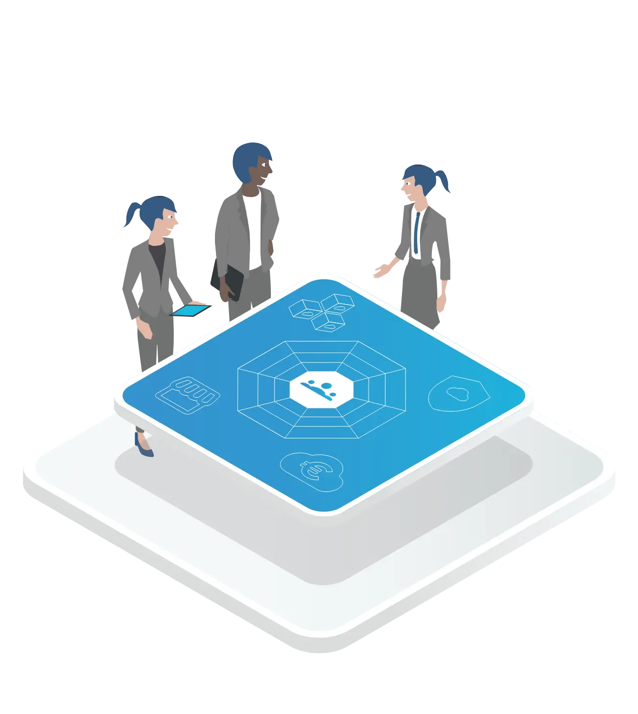

> **💡** **IT the cloud-native way: The Cloud Foundation as a central piece of a cloud strategy.**
> An organization’s Cloud Foundation offers cloud as a commodity for the software development teams across the organizaton.
> Providing a Cloud Foundation is an organizational and technological approach to managing the cloud. Its goal is to enable teams to build in the cloud and accelerate an organization’s software delivery. 

### What Is a Cloud Foundation?

A Cloud Foundation is an organization’s strategic approach to mastering its cloud transformation. This approach has two major aspects: An organizational and a technological one. Following the Cloud Foundation approach means putting development teams at the center and providing them with a single point of access for the management of their cloud infrastructure.

A Cloud Foundation is the interface for development teams to everything they need to focus on shipping software in the cloud.

#### The Cloud Foundation Team

The organizational part of a Cloud Foundation is a central cross-functional cloud team. It is effectively the team that pioneers and paves the way that is used by DevOps teams to safely travel to and navigate the cloud. The Cloud Foundation Team defines guardrails but the DevOps teams can keep up agility within these limits. 

The most important roles within a Cloud Foundation Team are: 

- Enterprise Architects

- Platform Engineers and Operators

- Security & Governance Stakeholders

Of course establishing a Cloud Foundation Team is not all it takes to transform an organization. Culture plays a significant role as classical IT roles move from building and managing infrastructure to enabling other teams to do so.

<!--notion-markdown-cms:raw-->
<CallToAction>
  <CtaHeader>Visualize Cloud Foundation responsibilities in your organization</CtaHeader>
  <CtaText>Use our template to understand relevant roles and easily build your own Cloud Stakeholder Map.</CtaText>
  <CtaButton class="btn-primary" url="https://www.meshcloud.io/cloudfoundation-stakeholder-map/">Download Cloud Stakeholder Map</CtaButton>
</CallToAction>

#### The Cloud Foundation Platform

No matter how an organization decides to implement its cloud governance, it always needs to cover the following functional pillars:

- [**🗂 Tenant Management**](https://cloudfoundation.meshcloud.io/maturity-model/tenant-management/)**:** Manage provisioning, configuration and lifecycle of cloud environments (e.g. AWS Accounts). This is often an original responsibility of cloud foundation teams that requires internal alignment between platform specialists.

- [**🔐 IAM**](https://cloudfoundation.meshcloud.io/maturity-model/iam/)**:** Provide Identity and Access management capabilities for all available cloud platforms and services. Needs alignment with Enterprise IAM stakeholders.

- [**🔖 Security & Compliance**](https://cloudfoundation.meshcloud.io/maturity-model/security-and-compliance/)**:** Provide capabilities for governing workloads and enforcing security guidelines across all available cloud platforms and services. Interfaces with IT Security and Compliance stakeholders.

- [**💵 Cost Management**](https://cloudfoundation.meshcloud.io/maturity-model/cost-management/)**:** Provide cost management and chargeback capabilities for all available cloud platforms and services. Interfaces with Finance/Controlling stakeholders.

- [**🛠 Service Ecosystem**](https://cloudfoundation.meshcloud.io/maturity-model/service-ecosystem/)**:** Provide managed services that help teams build and operate application on the cloud faster and more efficiently (e.g. on-prem connectivity). Interfaces with internal or external teams providing these services.

The Cloud Foundation Team needs a Cloud Foundation Platform to centrally integrate all these aspects of cloud governance for all cloud platforms. The goal is to leverage the potential of the cloud and move away from the operating methods of traditional IT.

### Why Build a Cloud Foundation?

#### Because IT Capabilities Spread out through the Organization

Digitization used to be the realm of IT. So IT was done for IT. A logical consequence was to divide IT according to the functional pillars. Nowadays, however, digitization affects every division, department and team of a company. 

1. Product teams develop new digital offerings to address market needs

1. Digital solutions improve internal processes varying from Sales and HR to the management of production plants or supply chains

1. Large amounts of collected data are analyzed and processed to gain insights that nurture organizations’ development

It follows that IT must also offer its services to everybody in the company. The demand for IT infrastructure from all over the organization is expected to reach a scale that risks to become a huge bottleneck.

There are now software developers in almost every specialist department. To meet their demands, IT must find its new role and move from building to enabling.

#### Because Cloud Means Doing Things Fundamentally Differently

What the cloud enables is fundamentally changing the tasks of the IT department. IT used to be centralized, installing systems centrally in the data center. This centralization leads to bottlenecks.

Most companies today manage their IT as a portfolio of "IT Services". IT Services provide distinctive functionality to customers. An "IAM Group" service may allow a internal customer to create and manage a group in the business's central directory. The owner of the "IAM Group" IT service can define how customers procure, manage, and get charged for the service.

Developing and running applications in this scenario puts a lot of overhead responsibilities on the shoulders of DevOps teams. And it grows with each cloud platform they add.

Optimizing in cloud silos can make each silo run its cloud platform perfectly, but it won't remove inefficiencies in the overall cloud transformation effort.

Global optimization is not possible in a silo structure: With a Cloud Foundation on the other hand you can optimize the entire cloud journey of your organization. The Cloud Foundation centralizes cloud governance competencies to enable and drive the cloud journey.

With the cloud, that no longer has to be the case; system architectures can be much more decentralized. With individual cloud accounts, there is no longer a technical reason for a centralized organization.

### How to Start Building a Cloud Foundation

#### New Responsibilities: From a Pyramid to a Network of Teams

To utilize the possibilities of the cloud, organizations transform from an organizational pyramid to a network of teams. With that, decisions don't have to pass through the narrow top of a pyramid inhibiting the speed the cloud provides.

Cultural mindset change takes longer than technical implementation or purchasing a tool. IT department management loses direct control in the new world because tasks and responsibilities are distributed.

In a decentralized, democratic structure more formalization is needed. And from a tooling perspective, companies need solutions that enable the network structure.

In a Cloud Foundation team boundaries and best practices can be shared better and faster leading to better platform-specific implementations.

#### Separation of Administration and Software Delivery

The Cloud Foundation approach frees DevOps teams from integrating different functional pillars. Instead, the cloud foundation team assumes responsibility for integrating the different functional pillars. Like the service offering of a cloud provider, the cloud foundation enables DevOps teams to provision and manage cloud services from a single organizational capability and leverage a consistent control plane offering API-driven self-service, IAM, and billing.

#### The Cloud Foundation as the Holistic Journey to the Cloud

To achieve integration between the different pillars, the Cloud Foundation team implements capabilities like a [**Multi-Cloud Tenant Database**](https://cloudfoundation.meshcloud.io/maturity-model/tenant-management/multi-cloud-tenant-database.html) and [**Federated Identity and Authentication**](https://cloudfoundation.meshcloud.io/maturity-model/iam/federated-identity-and-authentication.html). To provide [**On-Premise Network Connection**](https://cloudfoundation.meshcloud.io/maturity-model/service-ecosystem/on-premise-network-connection.html), the team provides an API-driven service that orchestrates provisioning an IP range from IPAM and then setting it up on AWS Transit Gateway.

Of course, building a cloud foundation is a challenging task. It can involve interesting technical challenges that allow an organization to achieve a high degree of automation that compares favorably to public services. However, achieving full-service automation is not required for adopting the cloud foundation as an organizational approach. The key to its success is that it absorbs responsibility for service integration and allows an organization to exercise holistic and effective cloud governance.

### About the Cloud Foundation Maturity Model

The Cloud Foundation Maturity Model is an abstraction of recurring themes in hundreds and hundreds of conversations with organizations that are on different stages of their Enterprise Cloud Journey. It captures the capabilities that organizations need to build in order to succeed at empowering DevOps teams with access to cloud infrastructure and services while staying in control.

The Cloud Foundation Maturity Model is **implementation agnostic**. While meshcloud initially created the model and offers a Cloud Foundation Platform, the model is concerned with “what capabilities are offered” and not “how are they implemented”.

<!--notion-markdown-cms:raw-->
<CallToAction>
  <CtaHeader>Explore the Cloud Foundation Maturity Model</CtaHeader>
  <CtaText>Get the full picture of where you are and the road ahead with the more than 50 building blocks.</CtaText>
  <CtaButton class="btn-primary" url="https://www.meshcloud.io/cloud-assessment-free-poster/#download">Download Free Poster</CtaButton>
	<CtaButton class="btn-secondary" url="https://cloudfoundation.meshcloud.io/maturity-model/">Explore the Building Blocks</CtaButton>
</CallToAction>

#### Finding Your Way around the Maturity Model

In the Cloud Foundation Maturity Model capabilities are called building blocks. The term “building block” emphasizes, that building a cloud foundation is a matter of putting together the right blocks (think LEGO) out of the variety of blocks that you could use. The essence of a building block is laid out in [**What is a Building Block**](https://cloudfoundation.meshcloud.io/maturity-model/what-is-a-building-block.html).

The model also captures how building blocks relate to each other. They are clustered in pillars of functionality like Tenant Management or IAM, can have dependencies (e.g. building a capability on top of another), and are assigned a “journey stage” that helps cloud foundation teams identify the capabilities that are relevant to them right now.