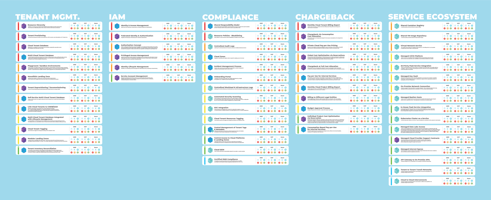

> **💡** The Cloud Foundation Maturity Model is a model that describes the capabilities Cloud Foundations are building to meet their customer’s needs.

<!--notion-markdown-cms:raw-->
<CallToAction>
  <CtaHeader>The Cloud Foundation Maturity Model as a Poster</CtaHeader>
  <CtaText>Get the full overview on more than 50 building blocks.</CtaText>
  <CtaButton class="btn-primary" url="https://www.meshcloud.io/cloud-assessment-free-poster/#download">Download Poster</CtaButton>
	<CtaButton class="btn-secondary" url="https://www.meshcloud.io/cloud-assessment-free-poster/#download">Get Your Physical Copy</CtaButton>
</CallToAction>

The Cloud Foundation Maturity Model is an abstraction of recurring themes in hundreds and hundreds of conversations with organizations that are on different stages of their Enterprise Cloud Journey. It captures the capabilities that organizations need to build in order to succeed at empowering DevOps teams with access to cloud infrastructure and services while staying in control. 

The Cloud Foundation Maturity Model is **implementation agnostic**. While meshcloud initially created model and offers a Cloud Foundation Platform, the model is concerned with “what capabilities are offered” and not “how are they implemented”.

## Structure of the Cloud Foundation Maturity Model

In the Cloud Foundation Maturity Model capabilities are called building blocks. The term “building block” emphasizes, that building a cloud foundation is a matter of putting together the right blocks (think LEGO) out of the variety of blocks that you could use. The essence of a building block is laid out in [What is a Building Block](/maturity-model/what-is-a-building-block.md).

The model also captures how building blocks relate to each other. They are clustered in pillars of functionality like Tenant Management or IAM, can have dependencies (e.g. building a capability on top of another) and are assigned a “journey stage” that helps cloud foundation teams identify the capabilities that are relevant to them right now. 

<!--notion-markdown-cms:raw-->
<CallToAction>
  <CtaHeader>Get started with the model</CtaHeader>
  <CtaText></CtaText>
  <CtaButton class="btn-primary" url="/maturity-model/service-ecosystem/virtual-network-service.html">Show me an example block</CtaButton>
  <CtaButton class="btn-secondary" url="/maturity-model/building-block-reference.html">Describe the model to me</CtaButton>
</CallToAction>

