<!-- unsupported block type: synced_block -->

The cloud foundation is an **organisational approach** to managing cloud adoption and consumption from a single organisational capability. A cloud foundation provides software development teams a single point of contact for provisioning, accessing and managing all cloud services they need to get their job done. Like a cloud provider, the cloud foundation offers its services using a unified control plane that covers tenant management, Identity and Access management (IAM) and billing. This frees teams from organizational burden and empowers them to focus on software delivery.

## From IT Services to Cloud Foundation

Most organisations today manage their IT as a portfolio of "IT Services". An IT Service provides a distinctive functionality to its customers. For example, an "IAM Group" service may allow a customer to create a group in the organization's central directory and manage its members through the service. The owner of the "IAM Group" IT service gets to define its own processes for how customers can procure, manage and get charged for the service.

With IT services as the established management paradigm in mind, most organizations trying to move to the cloud instinctively reach towards IT services for providing the required organizational capabilities to procure, manage and charge back cloud services (cloud governance). As the following section will demonstrate, this corrupts the advantages that cloud computing has to offer. Whereas cloud computing emphasises customer self-service, consistent API-driven automation and pay-per use, most IT services build on semi-manual processes, with inconsistent  provisioning workflow and charge back back to a shared cost pool.

> **💡** To take full advantage of cloud computing, organisations need to adopt a cloud-native organizational approach for providing capabilities to provision, manage and charge back cloud services.

## Functional Pillars of Cloud Governance

No matter how an organization decides to implement its cloud governance, it always needs to cover the following functional pillars:

<!-- unsupported block type: synced_block -->

- **🗂 Tenant Management:** Manage provisioning, configuration and lifecycle of cloud environments (e.g. AWS Accounts). This is often an original responsibility of cloud foundation teams that requires internal alignment between platform specialists.

- **🔐 IAM:** Provide Identity and Access management capabilities for all available cloud platforms and services. Needs alignment with Enterprise IAM stakeholders.

- **💵 Cost Management:** Provide cost management and chargeback capabilities for all available cloud platforms and services. Interfaces with Finance/Controlling stakeholders.

- **🔖 Security & Compliance:** Provide capabilities for governing workloads and enforcing security guidelines across all available cloud platforms and services.  Interfaces with IT Security and Compliance stakeholders.

- **🛠 Service Ecosystem:** Provide managed services that help teams build and operate application on the cloud faster and more efficiently (e.g. on-prem connectivity). Interfaces with internal or external teams providing these services.

While representing independent functions, organizations need to integrate these functional pillars to implement an effective and wholistic cloud governance.

As an illustration, let's look at the dependencies of the Tenant Management pillar. For an effective cloud governance, each of the pillars needs to maintain different metadata associated with a cloud tenant (e.g. an AWS Account).

```mermaid
flowchart BT;
  subgraph Pillars["Functional Pillars of Cloud Governance"]
    %% direction TB;
    Tenant["🗂 Tenant Management"]
    IAM["🔐 IAM"]
    Services["🛠 Managed Services"]
    Compliance["🔖 Compliance"]
    Chargeback["💵 Chargeback"]
		%% Tenant<-.->IAM & Services & Compliance & Chargeback
		Tenant<-.what are the permissions for?.->IAM
		Tenant<-.where to provision service?.->Services
		Tenant<-.who is responsible?.->Compliance
		Tenant<-.who bears the cost?.->Chargeback
  end
  DevOps["DevOps Team"]
  DevOps --> Tenant & IAM & Services & Compliance & Chargeback

```

<!-- unsupported block type: toggle -->

<!-- unsupported block type: embed -->

Manually maintaining this associated metadata in different functional silos is challenging and burdensome. Data inconsistencies are likely and make applying good governance difficult. Imagine detecting a critical security vulnerability in one of your AWS Accounts, only to figure out that the responsible security contact is no longer working at your organization...

This example is only scratching the surface of the complex interdependencies that can exist between pillars. Managed services for example will require integration with IAM (who can order, configure a service?), Compliance (is the service allowed for a particular cloud environment?) and Chargeback (who's going to pay for the service?) etc.

## A Team's Cloud Journey - with IT Services

Let's look at the cloud journey for a DevOps team that wants to build a typical cloud application. The team wants to take advantage of cloud-native services for machine learning, however it also needs access to on-premise systems that hold required data. The team therefore needs a cloud tenant and on-premise connectivity. When an organisation manages its cloud capabilities as IT Services, the team's cloud journey will look like this:

```mermaid
flowchart BT;
  DevOps["DevOps Team"]
  subgraph IT Services
    Platform["🗂 Platform Team"]
    IAM["🔐 Enterprise IAM"]
    Network["🛠 Network Team"]
    Finance["💵 Finance and Controlling"]
    Security["🔖 IT Security"]
  end
  DevOps--1. Order<br>cloud tenant-->Platform
  DevOps--2. Set up IAM groups according to<br>platform team's requirements-->IAM
  DevOps--3. Order IP Range-->Network
  DevOps--4. Order<br>on-prem connectivity-->Platform
  DevOps--5. Security Review-->Security
  DevOps<-- receive quartely chargeback report-->Finance
```

<!-- unsupported block type: toggle -->

<!-- unsupported block type: embed -->

As the figure above illustrates, the team needs to "shop around" different services and integrate their capabilities. Provisioning each service involves finding the right contact point, following its procurement process and then composing it with other services. This is a challenge as teams may need to learn about the hidden interdependencies between IT services and how they can make them "click" together. For example, when a Team provisions a new AWS Account, they may need to set up an IAM group with a conventional name that contains the AWS Account number.

## A team's Cloud Journey - with a Cloud Foundation

The Cloud Foundation approach frees DevOps teams from integrating different functional pillars. Instead, the cloud foundation team assumes responsibility for integrating the different functional pillars. Like the service offering of a cloud provider, the cloud foundation enables DevOps teams to provision and manage cloud services from a single organisational capability and leveraging a consistent control plane offering API-driven self-service, IAM and billing.

```mermaid
flowchart BT;
  subgraph Pillars["Cloud Foundation"]
    %% direction TB;
    Foundation["☁️ Cloud Foundation"]
    Tenant["🗂 Tenant Management"]
    IAM["🔐 IAM"]
    Services["🛠 Managed Services"]
    Compliance["🔖 Compliance"]
    Chargeback["💵 Chargeback"]
		Foundation<-.->Tenant & IAM & Services & Compliance & Chargeback
  end
  DevOps["DevOps Team"]
  DevOps --> Foundation
```

<!-- unsupported block type: toggle -->

<!-- unsupported block type: embed -->

To achieve integration between the different pillars, the Cloud Foundation team implements capabilities like a [Multi-Cloud Tenant Database](/maturity-model/tenant-management/multi-cloud-tenant-database.md) and [Federated Identity and Authentication](/maturity-model/iam/federated-identity-and-authentication.md) . To provide [On-Premise Network Connection](/maturity-model/service-ecosystem/on-premise-network-connection.md) , the team provides an API-driven service that orchestrates provisioning an IP range from IPAM and then setting it up on AWS Transit Gateway.

Of course, building a cloud foundation is a challenging task. It can involve interesting technical challenges that allow an organization to achieve a high degree of automation that compares favorably to public services. However, achieving full service automation is not required for adopting the cloud foundation as an organizational approach. The key to its success is that it absorbs responsibility for service integration and allows an organization to exercise wholistic and effective cloud governance.

> **💡** Most organizations find  the most difficult challenge in building a cloud foundation is the required interdisciplinary collaboration and alignment of different stakeholders.

## Summary

Here is how the Cloud Foundation approach compare to the IT Services approach.

<!-- included database 3fe4130d-5cc2-4fce-8dac-20675cb0c4fd -->
| Criteria                     | IT Services                                                                                                                                                                                                       | Cloud Foundation                                                                                                                                    |
| ---------------------------- | ----------------------------------------------------------------------------------------------------------------------------------------------------------------------------------------------------------------- | --------------------------------------------------------------------------------------------------------------------------------------------------- |
| Function Alignment           | Stakeholder-to-Stakeholder or Service-to-Service. Lack of global coordination. Missing visibility of governance capabilities across functional pillars leads leading to blind spots.                              | The Cloud Foundation team acts as a single point of contact to all stakeholders and creates alignment and visibility about governance capabilities. |
| Points of Contact            | DevOps teams need to contact each IT service owner individually. Service owners need to maintain individual customer databases with metadata and billing info.                                                    | DevOps teams use the Cloud Foundation as a single point of contact to maintain project metadata and billing info.                                   |
| Prevalent Automation Pardigm | Semi-manual workflows.                                                                                                                                                                                            | Declarative and API-driven automation.                                                                                                              |
| Service Integration          | DevOps Teams need to individually connect and integrate services. They need to learn about potential hidden interdependencies between services they want to consume and resolve resulting integration challenges. | The Cloud Foundation assumes responsibility for integrating required services and makes the result available as a consistent, integrated offering.  |